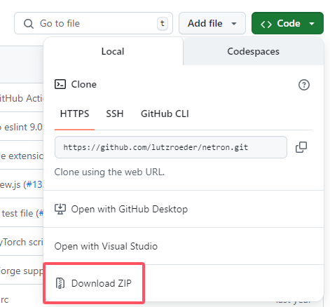
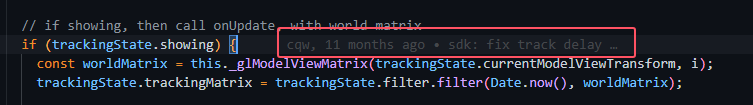

# git 教程

## 中二开头

一日，mt改了群友电脑上的代码qwq

有群友高呼：你改了什么代码mt！你这样改我该如何应对！

只见mt淡淡一笑：很简单，你用 git, 不就好了。

说罢，他的命令行终于不再掩饰————git指令！群友为之一寂！

忽然吟道：

早岁已知开发难，代码记录藏心间。

平日开发无人问，日日冲突遭责问。

提交推送勤修炼，回滚重置似梦难。

今朝代码无敌路，是我Git修行人。

顷刻炼化，终于成尊！

## 等一下！

Git 是啥呀！o.o 听起来好酷炫！可是我为什么需要它呢？

Git是一个分布式版本控制系统，用于**跟踪文件的变化**，**协作**开发和**管理**代码。它允许多个开发者同时工作在同一个项目上，记录每次修改的历史，方便回溯和合并不同的代码版本。

### git 的魔法! owo

1. **历史回溯**：git能够让法师们查看过去施放的所有魔法记录，帮助他们在遇到魔法失控（代码错误）时，迅速回到更安全的魔法状态（历史版本）。

2. **法师联盟**：在这个神秘的世界中，许多法师可以共同施展更强大的魔法。git的巫术（分支与合并）使得每位法师能够在各自的魔法领域中开展独立研究，同时又能轻松汇聚成强大的合作力量。

3. **分支的树木**：git赋予每一个法师从主干延展出无数枝叶的能力（分支）。这些枝叶代表着不同的魔法实验与研究路径，法师们可以自由地尝试新法术，而不必担心破坏根本的魔法树（主代码库）。

4. **守护完整性**：git以一种古老的符文（SHA-1 哈希）来锁定每一次施法的魔法纹路，确保每一丝魔法的力量都未受到损坏，任何不和谐的变动都会被快速识别（数据完整性检测）。

5. **无尽的旅程**：在这个神秘领域中，git允许每位法师即使在魔法之境的异空间（离线环境）中，也能施展大部分魔法，而无需依赖连接到其他法师的能量源（网络）。

6. **简易咒语**：git的智慧也体现在其简单而高效的咒语（命令行工具）上，赋予法师们轻松而灵活地掌控和管理他们的魔法世界。

git是魔法世界中的神器，是每位法师在他们的魔法旅程中不可或缺的伙伴，帮助他们创造与协作，探索无穷的可能性！OwO

## 友情提示

- 如果你听说过 github，首先忘掉它！
- 如果你还没安装 git，现在就来安装！
- 如果你使用过 gui，那么关掉 gui！
- 以后你的 vscode 里要装好几个 git 插件，但建议只用来看，不用来操作！
- 以及我也不知道该咋讲 git 的概念，但先用起来再说！

## 安装 git

### windows

https://git-scm.com/download/win

下载下来安装就行了

### linux

#### ubuntu

```bash
sudo apt install git
```

#### Arch Linux

```bash
sudo pacman -S git
```

#### 其他

其他 linux 系统自己想办法，毕竟你都会linux了qwq

## git 使用

如果你是 windows 用户，在一个"合适的文件夹"，右键并选择 'Git Bash Here'；
如果你是 linxu 用户，打开你的终端，cd 到一个"合适的文件夹"

### 注意

除非特别说明，目前我们的操作都只在我们自己的电脑上（本地/Local）生效。

### 代码仓库

如果你也像这样下载过 github 的代码，那么以后你再也不会这么做了！



↑↑↑↑↑↑ 不要这样做！！！ ↑↑↑↑↑↑

#### 什么是代码仓库(repository)

因为这样下载的文件夹内，只有代码文件，而没有文件的“历史记录”。

由 git 管理的代码仓库内，git 忠实地“记录”了每一个文件、每一行的修改记录，就像下面这样，我知道这行 bug (并不是bug) 是谁在什么时候写的！



就算某次代码更新时删掉了一个文件，（由于git 记录了这个文件的信息，）只要回到以前的"版本"(而且只需要一行命令！)，这个文件就又会回来了qwq。而这些信息，都存放在代码仓库目录下的隐藏文件夹 .git/ 里（名字以.开头就是隐藏文件、隐藏文件夹啦）

#### git clone

为了完整地下载代码仓库，需要使用 git clone 命令

```bash
git clone https://github.com/martellz/git_tutorial.git
```

这条命令会把链接上的"代码仓库"克隆到你所在的"合适的文件夹"。
其实这个链接就是这个教程的代码仓库的链接啦。

## 本章作业

如果你成功地 clone 了我的 git_tutorial 仓库，那么尝试：

- 在 github 上 clone 任意一个别的仓库

- 在 其他任意一个代码托管平台上（例如gitee/gitlab）clone 任意一个代码仓库
