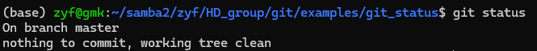
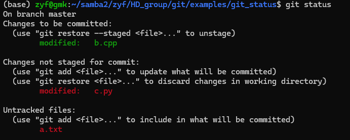
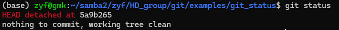
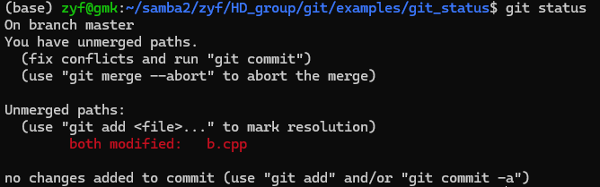
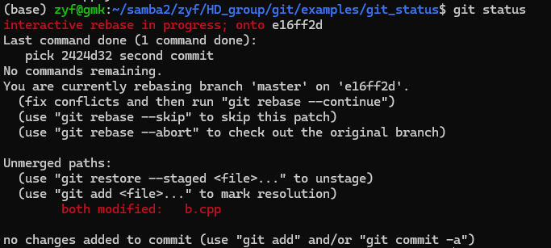

# git status

git 命令行中最常用的命令就是 git status 了！因为你总是需要先知道当前 git 的状态，然后再去做别的事情（除非你记得非常清楚之前做了什么，以及非常明白自己每一步的结果！）

ps: 这就好像 ls 指令一样，大家总是习惯先看看当前目录下有啥文件再说。

## 使用

新手可以在任何情况下放心使用 git status！它不会修改东西，不会把任何东西搞崩的qwq

### 示例0

那么现在有一个没有任何改动的 git 项目，使用 git status 出现结果如下

这是很干净的状态，刚 git clone 下来的代码仓库都长这样，其中

On branch master 表示当前在 master 分支（一般是主分支）（先记得这个问题：什么是分支？）

nothing to commit, working tree clean 就表示啥改动也没有

### 示例1

那么现在有一个有代码改动的 git 项目，使用 git status 出现结果如下

这是较为常见的状态，其中（先忽略图中括号内的提示）：

Changes to be committed 表示已 add 的改动（先记得这个问题：add是啥操作）

Changes not staged for commit 当然就是表示没 add 的改动

Untracked files 表示 git 没在跟踪的文件（没在跟踪当然 git 就不知道它改没改）

### 示例2

这里看起来有个红色的信息很重要！

HEAD detached at 5a9b65 表示 HEAD 指针目前分离于 5a9b265。

#### 提前的解释

HEAD 也就是头指针，指向的是当前的提交（快照）/分支。HEAD 分离于 5a9b265 表示头指针没有指向分支，而是指向了一个快照 5a9b265。（HEAD指向快照 5a9b265，说人话就是当前的快照是 5a9b265 这个快照）

##### 解释中的解释

分支以后再说；

提交（快照）可以理解为项目所有文件的一个记录（这意味着可以有很多记录，你可以在各种历史记录中随意切换）,而 5a9b265 则是这个记录的 hash 值（的前7位，事实上这个值是5a9b265104fc7c795a50c23e94483d923e2d8dee）

###### 解释中的解释中的补充（简单看看就行了）

这个 hash 值是 SHA-1 hash，如果不了解Git提交对象的可怕细节，那么你只需知道它是根据它所代表的信息直接生成的、一个很大的、不能更改加密字符串。

你不知道的是，除了提交作者、日期和存储的数据等所有明显的信息外，每个提交还包含上一个提交的hash值。这正是生成提交历史记录的方式。每个提交都知道它前面的提交的哈希值。（？？！）

### 示例3（简单看看就行了）

现在有一个处于某个神秘状态的 git 项目，使用 git status 出现结果如下

看不懂就对了，记得以后回来再看qwq

### 示例4（简单看看就行了）

现在有一个处于某个神秘状态的 git 项目，使用 git status 出现结果如下

也是看不懂就对了，记得以后回来再看qwq

## 总结

总之，你可以随意使用 git status，来帮助你了解当前的 git 状态，以及下一步使用什么 git 指令！是最基础的、最简单的指令哩qwq