# git add/commit

之前提到，git 可以记录文件的修改历史，那么今天我们就来学习如何记录！

## 三个存储区域

对于 git 项目来说，有三个用作“存储”的区域：工作区、暂存区、本地仓库。

### 工作区

工作区就是你电脑里能看到的文件夹，大家肯定都会用qwq

### 暂存区

暂存区，很明显是一个临时存储区域，它在 .git 这个隐藏文件夹中。它用于保存即将提交到本地仓库的更改，而提交完成时它里面就什么东西都没有啦。

### 本地仓库

本地仓库是 git 记录文件修改的地方，它也在 .git 这个隐藏文件夹中。既然暂存区是临时的存储区域，那么相对的本地仓库就是持久的存储区域啦。

注意这里的“本地”，既然有本地仓库，那当然也有“非本地”仓库，也就是远程仓库啦。

### 一图流

但有两张图qwq

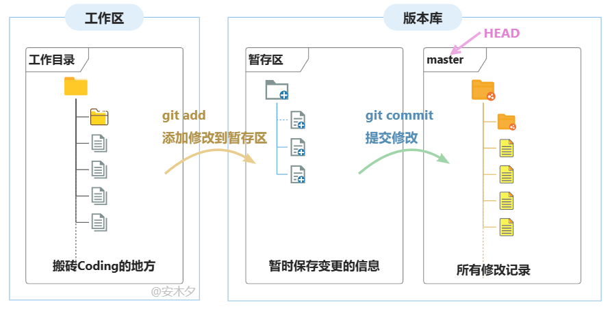

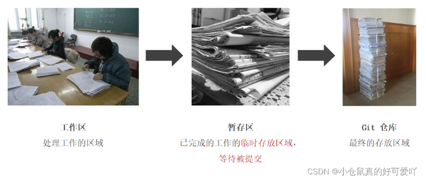


## git add

看图，`git add` 指令就是把写的bug添加到暂存区qwq

### 示例

例如，我现在有个文件 b.cpp，里面的内容是这样的

```cpp
#include <iostream>

int main() {
  std::cout << "pig pig black pig" << std::endl;

  return 0;
}
```

现在我们在其中加一行

```cpp
#include <iostream>

int main() {
  std::cout << "pig pig black pig" << std::endl;
  std::cout << "black pig pig pig " << std::endl;   // 加了这一行

  return 0;
}
```

用 `git status` 指令查看当前的状态

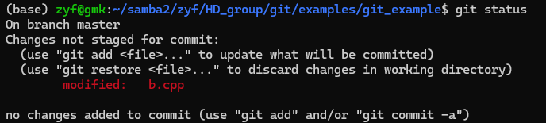

这里的红色字体表示：这个文件的修改没有存到暂存区，现在我们用 git add 指令把它add进暂存区，然后再用 git status 查看当前状态

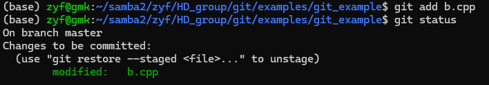

它变绿了，就说明它被加入到暂存区了qwq。如果我们现在继续在 b.cpp 上增加内容，然后再 `git status`

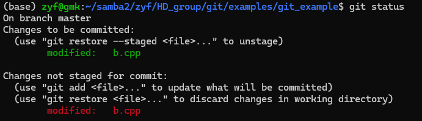

它就会既有红又有绿，说明有些改动在暂存区中，有些没有qwq。

#### git add 用法

从上面的例子可以看到，我们可以用`git add`添加一个（其实可以多个qwq）文件到暂存区，也就是

```bash
git add [file1] [file2] [file3] ...
```

git 也支持用星号*来匹配多个文件，例如

```bash
git add black_pig*
```

#### git add 技巧1

我们把新的改动也加入暂存区吧，不过这次我们用一点小技巧！输入 `git add .`，它的含义是把当前目录下（包括子目录）所有的文件（注意是文件，而不是文件修改哦）加入暂存区。（虽然我们现在只有一个文件b.cpp）

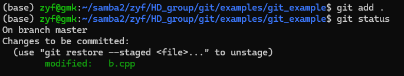

好啦，这样 b.cpp 的新改动也加入暂存区啦。那么这个技巧就是，我们可以直接把一个目录的所有文件添加到暂存区qwq！

```bash
git add [一个目录]
```

#### git add 技巧2（更实用！）

考虑这样一个情况，虽然我们只用了一条指令 `git add .`，就能添加所有文件到暂存区，但如果我们不想添加所有文件到暂存区呢？

例如，我们的代码生成了许多临时文件，这些文件我们不想加入暂存区（因为暂存区最后要存到代码仓库里。太太，你也不想你的代码仓库存了一些乱七八糟的文件吧qwq）。比如下图中的“xxxxxx.txt”、.vscode文件夹。

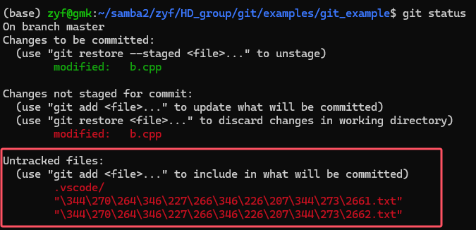

ps: 如果把乱七八糟的文件加入了暂存区怎么办？可以去搜索一下 `git rm --cached`，我就不细说哩。

这个时候，我们只想把git跟踪的所有文件（换句话说是git add过的文件）加入暂存区。那么我们可以使用 `git add -u` 指令！

```bash
git add -u
```

结果如下，b.cpp的改动加入了暂存区，但乱七八糟的文件没有qwq！好耶！

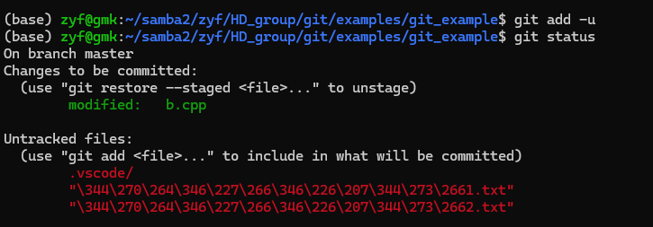

### git add 总结

至此，大家应该明白 `git add` 的用法和意义哩！它就是把想要追踪的文件，加入git的暂存区。


## git commit

当我们对暂存区内的修改满意了之后，我们就可以把暂存区的内容存到本地仓库了！这样就能持久地保存我们这一次的修改记录了！

### 什么是 commit（提交）

对于新手来说，可以将提交理解为快照，或是和上一次提交的差异（或是两者都有）。按这两种方式理解git时，git都可以保存、回溯每一次提交的内容，但git的底层实现可不一定是这样的哦qwq

（这里说句题外话，docker 也有快照的功能。它保存镜像时，也不是将镜像作为一个整体直接保存的哦qwq）

提交是以时间顺序排列被保存到数据库中的，就如游戏关卡一样，每一次提交（commit）就会产生一条记录。你可以使用 `git log` 指令查看历史提交记录！

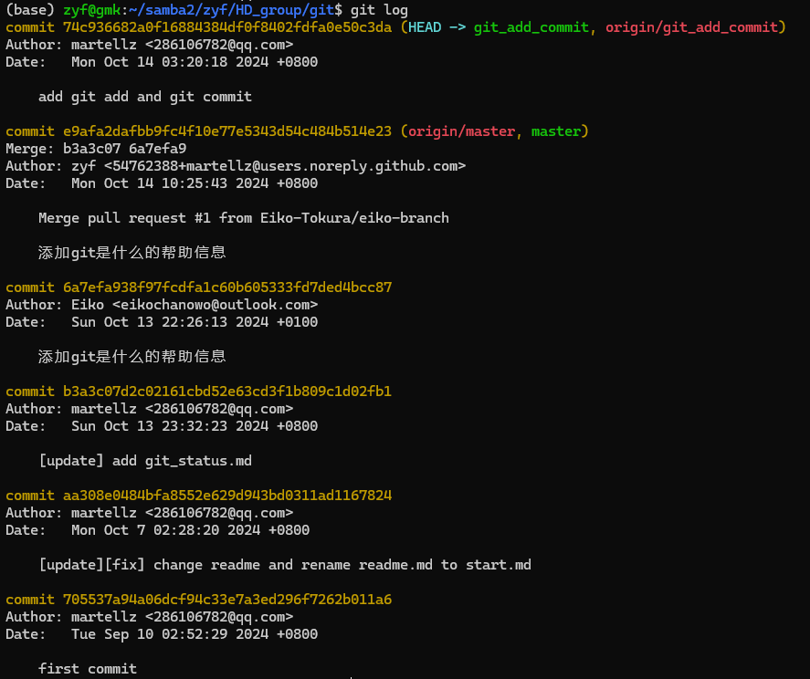

### git 的历史提交记录

说到记录，就不得不说 git 是如何保存这些记录的。

目前来说（目前来说！），git 的历史记录看起来是链式结构：HEAD指针（前文提到过）指向我们当前的提交，而每一次提交又指向上一次的提交，这样我们就能知道所有的历史提交啦。每一次新增记录时，新提交再指向当前HEAD指向提交，HEAD再指向新提交，就可以啦qwq。

（等一下，这么说的话，万一我有100,000,000,000,000个提交，那要看最初的历史记录岂不是要很久很久！？快给git想个办法qwq）


### git commit 用法

git commit 用于将暂存区的内容保存到本地仓库，指令是`git commit`，随后命令行会进入一个默认的编辑器，并要求提供提交信息（commit message）。关闭编辑器后，若有有效的commit message，则会提交成功！

提交信息的话，写对这次修改的描述、说明（让其他小伙伴看懂即可qwq）

#### git commit 技巧1

```bash
git commit -m "双引号内填commit message"
```

用-m替代了编辑器编辑的步骤，但还是会进入编辑器（进去后直接关闭即可qwq）

#### git commit 技巧2

有时候，我们提交了一个“不好”的记录，有可能是写出了bug，有可能是忘了加东西，有可能是commit message写的不好，等等。

这个时候我们不想新增一个记录（因为没必要为了很小很小的改动再增加一个提交，其他人看到也会困惑qwq），而是将需要修改直接加到刚刚的错误提交上。

例如我的一次提交中，忘了这一行

```c++
std::cout << "pig pig black pig" << std::endl;
```

那么首先在文件中加上这一行，然后用 `git add` 将代码修改存入暂存区，最后用 `git commit --amend` 提交到本地仓库，它会覆盖掉上一次的错误记录qwq。另外这个时候命令行会重新打开编辑器，如果commit message需要修改，这个时候就可以修改。

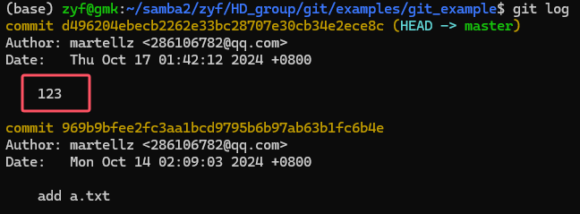

↑↑↑↑↑↑↑↑↑↑↑↑↑↑↑↑↑↑ 修改前

↓↓↓↓↓↓↓↓↓↓↓↓↓↓↓↓↓↓ 修改后

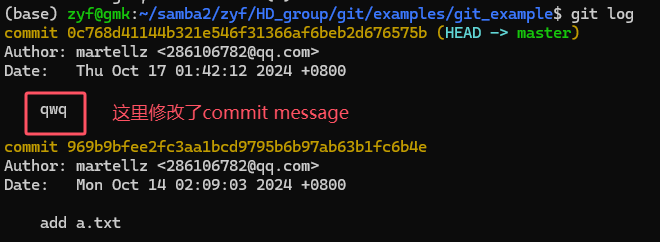


## 本章作业！

### 这个只用执行一遍

在一个全新的、没有修改的 git 仓库中，先执行

```bash
git checkout -b homework3
```

### 以下是你需要做的

对代码文件做任意修改后，新增一个提交！

至于交作业的方式嘛，截图给群友康康就行哩qwq
