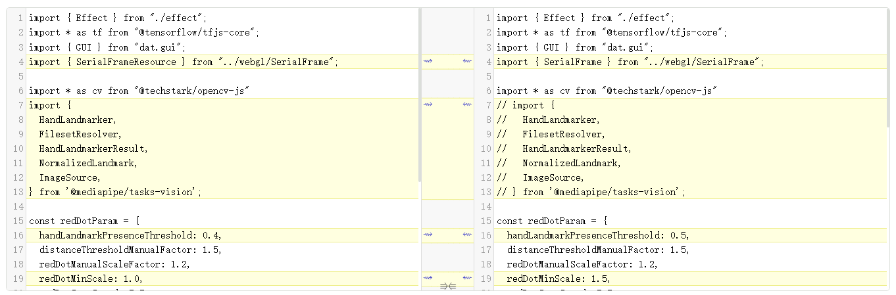
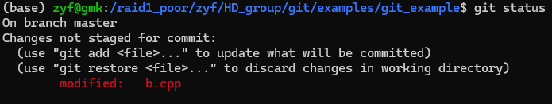
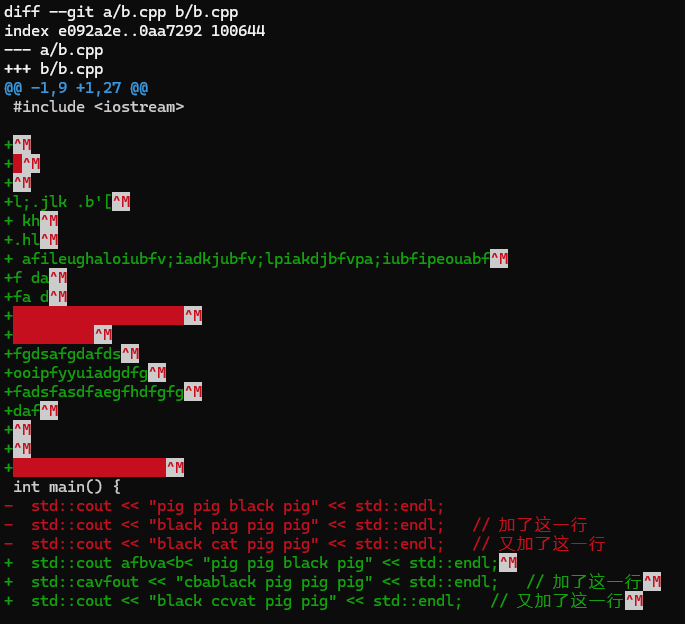
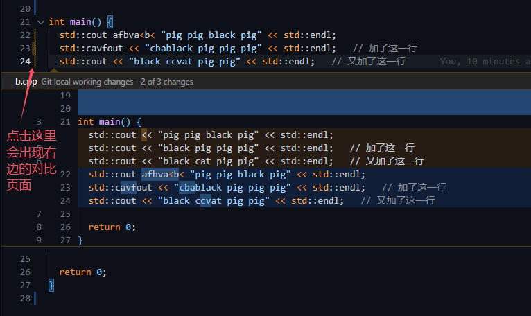
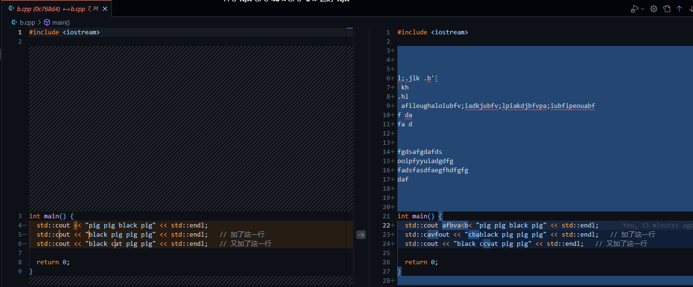
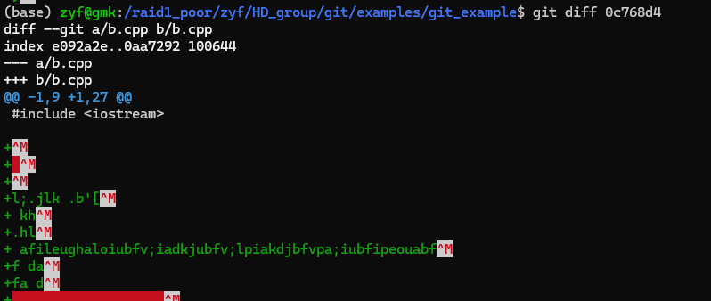

# git diff

上集说到，对于新手来说，可以将提交理解为快照，或是和上一次提交的差异，那么这一集我们可以“先”基于差异来理解 git 的历史提交记录。（实际的底层实现感兴趣可以自己查查qwq）

那么既然 git “可以理解为”记录的是提交间的差异，那说明他可以得到提交之间的差异qwq

## 代码之间的差异(difference->diff)

假设一只捣蛋黑猫碰巧在你的键盘上乱按了很多下，修改了你的代码，又碰巧按到了保存快捷键，并且因为某些原因碰巧无法撤销（比如关掉了显示器，甚至电脑qwq）。

这个时候你要怎样快速知道自己的代码哪里被修改了呢qwq？

ps: 这个例子后面还会再出现的！因为有更好用的方法，直接让捣蛋黑猫干的坏事消失qwq

### 代码比对工具

有的同学可能用过在线的代码比对工具，它会左右显示修改前后的文件，把修改过的代码行高亮出来，如下图



但在线比对工具需要你有改动前的代码，怎么办！

### 直接和git记录对比

没错！git 记录里有改动前的代码！git 自身也有代码对比的功能！

首先，使用 git 的起手式 `git status`，可以看到原来捣蛋黑猫只改了一个文件



接下来就要使用 `git diff` 了，好家伙！给我键盘一顿乱按改了这么多！



可以看到，绿色的部分是新增的行，红色部分是删掉（或被改掉的行）

（中间那些红色填充部分其实是新增的空格，只不过编辑器给他填充成红色了，可能编辑器认为代码结尾有空格是值得警告用户的事情qwq）

好叭，在学习更好用的 git 方法解决之前，`git diff` 起码让我们可以复制粘贴解决这个问题了。

### (optional) vscode git工具

只作了解即可qwq

如果你在 vscode 里打开这个文件，行号旁边的颜色会告诉你这里有代码被改动、新增或删除。



另外也有这种左右的对比界面



总之具体的gui页面大家以后再了解叭，而且大家要有能只用纯命令行的能力哦qwq

## git diff 用法

git diff 表示当前文件内记录的内容，和当前暂存区之间的差异。

看来黑猫吃了不会 git 的亏，如果它学了上节课的 `git add`，那么我们只用 `git diff` 就看不出差异了qwq！

### git diff 技巧1

假设黑猫为了捣蛋生效，努力学会了`git add`，并成功的把它的捣蛋改动加入了暂存区，那我们该怎么办？不怕，我们有

```bash
# <commit> 可以是上节课提到的提交的hash值（可以只用前7位数），也可以是任何指向提交的“指针”。
# 至于这些“指针”有什么形式，以后大家会知道的。总之这里只要能唯一确定是哪个提交就行qwq

# 中括号内的内容表示可省略，省略的话就是上面的指令啦
git diff [<commit>]
```

还是通过上节课的`git log`指令，我们可以知道最新的一次提交的hash值！那么我们用 `git diff 0c768d4` 就可以看到了！



等下，上上节课说过，有个叫 HEAD 的指针一直指向最新的提交记录。那么我们也可以 `git diff HEAD`,和上面是一样的效果。

### (optional) 题外话：如果黑猫使用 git commit --amend 呢？

假设黑猫为了捣蛋生效，领会贯通了上一节课，他想：既然你们只要知道 commit 就能看出我改了什么，那么我让你们找不到之前 commit 不就行了！

说罢，顷刻炼化，黑猫使用 `git commit --amend` 修改了提交历史，`git log` 中当前提交的 hash 值被修改了！

快想想看现在还有什么办法qwq

提示：看本节课的开头

### git 技巧2

git diff 也可以只比较部分文件中的修改，我们传入对应的文件路径即可

```bash
# 中括号内的内容表示可省略，中间的 -- 也可以省略哦

# 这里的 [<path>...] 表示可以传多个路径参数
git diff [<commit>] [--] [<path>...]

# 例如
git diff -- b.cpp
git diff HEAD a.txt c.py

# 总之这里心里要清楚是在跟哪个区域的记录对比，以及对比的是哪些文件qwq
```

### git 技巧3

git diff 也可以比较两个提交记录之间的、某些文件的修改，我想你已经能猜到命令是什么了，去试试！

## 一般的使用场景

对于我来说，我一般用 `git diff` 去查看：
- 要新增提交时，我改了哪些代码，以及其中是否有不必要的、debug用的代码需要删掉
- 在“某些"（原谅我为了不引入太多新东西用某些）过程中，查看当前的代码变动
- 可以看某个文件中，某一段的bug到底是谁写出来的（不过有更好的方式qwq）

## 本章作业！

使用 `git diff`和其他学到的 git 指令，查看你上一节课的作业中的提交里，都改了哪些地方！还是截图给我或者群友康康qwq
